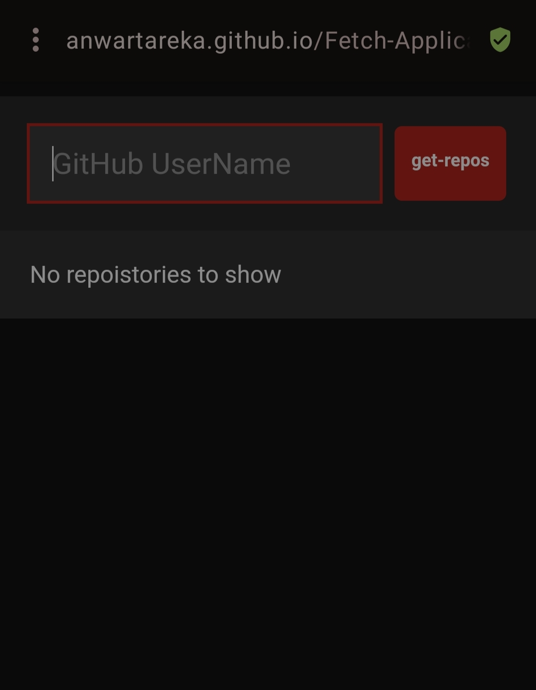
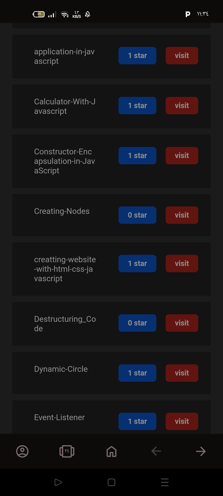
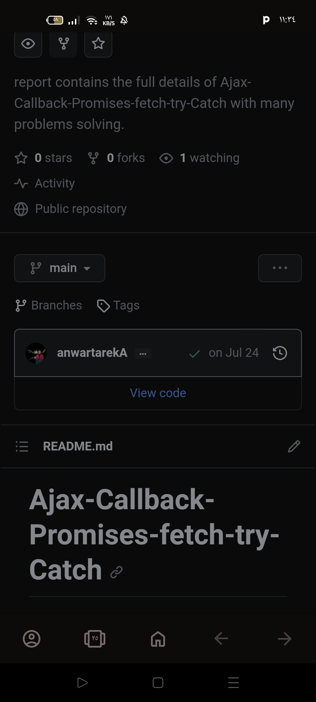

# Fetch-Application
### Fetch app every one can get his repositories from github.
#### Description:-
  ##### This application depending on the fetch go get the request from the server.
 This application deals with Github server by sending the request from the user in the input user and click on get repos so you can get your all repositories without entering the github platfrom you can use this 
 application for geting them .
 ##### Steps for sending the request and get the response from server [GitHub].
 ###### 1- Calling the Fetch Method (Fetch('URL')). [Pending]
 ###### 2- User send the requset from the input box and click on [Get-Repos] -- [Sending].
 ###### 3- Server receives this request .
 ###### 4- Server Process this request.
 ###### 5- the response will be sent to the user if the request successfully -- [FullFill] .
 ###### 6- the response will not be sent to the user if the request Failed -- [Reject].
 #### Images of the application:-
 ###### starting:-
 .
 ###### after entering the GitHub Username:-
 .
 ###### When click on visit:-
  .
## [Link](https://anwartareka.github.io/Fetch-Application/).
